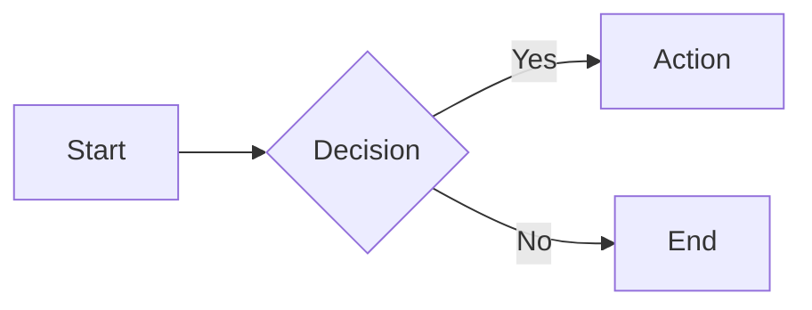

# Slide Builder

Create presentations with Slidev. Deploy to rebyte.pro.

## Workflow

1. **Plan content** - Understand the presentation goal, audience, and structure
2. **Initialize** - `bash scripts/init.sh <name> [theme]`
3. **Write slides** - Edit `/code/<name>/slides.md`
4. **Deploy** - `bash scripts/build-deploy.sh` → returns preview URL
5. **Export** (optional) - `bash scripts/export.sh pdf|pptx`

## Content Guidelines

### Structure

Every presentation needs:
- **Opening** (1-2 slides): Hook + agenda
- **Body** (80% of slides): Main content in logical sections
- **Closing** (1-2 slides): Summary + call-to-action

### Slide Count by Duration

| Duration | Slides | Pace |
|----------|--------|------|
| 5 min | 5-7 | ~1 min/slide |
| 15 min | 12-15 | ~1 min/slide |
| 30 min | 20-25 | ~1.5 min/slide |
| 45 min | 30-35 | ~1.5 min/slide |

### Content Rules

1. **One idea per slide** - If you need "and", split it
2. **6 words per bullet, 6 bullets max** - Slides support speech, not replace it
3. **No walls of text** - If reading takes >10 seconds, trim it
4. **Show, don't tell** - Prefer diagrams, code, images over prose
5. **Use animations sparingly** - Only for progressive reveals that aid understanding

### Layout Selection

| Content Type | Layout | When |
|--------------|--------|------|
| Title/section | `cover` | Opening, section breaks |
| Regular content | `default` | Most slides |
| Comparison | `two-cols` | A vs B, before/after |
| Feature + visual | `image-right` | Screenshots, diagrams |
| Key metric | `fact` | Statistics, numbers |
| Quote | `quote` | Citations, testimonials |
| Closing | `end` | Final slide |

## Slidev Syntax Quick Reference

### Slide Separator

```markdown
---

# Slide 1

Content

---

# Slide 2

More content
```

### Frontmatter (First Slide)

```yaml
---
theme: seriph
title: My Talk
background: https://cover.sli.dev
transition: slide-left
---
```

### Layouts

```markdown
---
layout: two-cols
---

# Left

Content

::right::

# Right

Content
```

### Code with Highlighting

```markdown
```ts {2-3|5}
const a = 1
const b = 2  // highlighted first
const c = 3  // highlighted first
const d = 4
const e = 5  // highlighted second
```
```

### Click Animations

```markdown
<v-clicks>

- Appears first
- Appears second
- Appears third

</v-clicks>
```

### Mermaid Diagrams

```markdown

```

### Speaker Notes

```markdown
# Slide Title

Content

<!--
Speaker notes here (press P to view)
-->
```

## Available Themes

| Theme | Style | Best For |
|-------|-------|----------|
| `seriph` | Elegant serif | Conference talks (default) |
| `default` | Clean minimal | Internal meetings |
| `dracula` | Dark purple | Developer audiences |
| `geist` | Modern tech | Startup pitches |

To change: edit `theme:` in frontmatter and add package to package.json.

## References

Load as needed based on presentation requirements:

| Topic | File | Contents |
|-------|------|----------|
| Layouts | `references/layouts.md` | All layout options, image layouts, iframe layouts |
| Animations | `references/animations.md` | v-clicks, transitions, Magic Move, motion |
| Components | `references/components.md` | Video, icons, Vue components, math |
| Diagrams | `references/diagrams.md` | Mermaid, PlantUML, all diagram types |
| Styling | `references/styling.md` | UnoCSS, themes, fonts, colors |
| Advanced | `references/advanced.md` | Presenter mode, export, recording, config |

## Example: Tech Talk Structure

```markdown
---
theme: seriph
title: Building Fast APIs
---

# Building Fast APIs
## Lessons from Production

---
layout: center
---

# The Problem

Our API p99 was 2 seconds

---

# What We Tried

<v-clicks>

- Caching (helped 20%)
- Database indexes (helped 30%)
- Connection pooling (helped 50%)

</v-clicks>

---
layout: fact
---

# 150ms
Final p99 latency

---
layout: two-cols
---

# Before

- 2s p99
- 100 req/s max
- Frequent timeouts

::right::

# After

- 150ms p99
- 2000 req/s
- Zero timeouts

---
layout: end
---

# Questions?

github.com/example/fast-api
```
