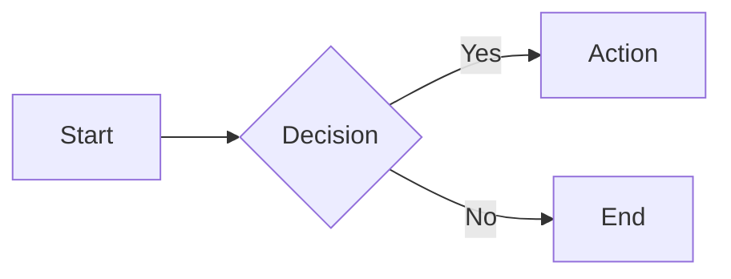

# Slide Builder

Create presentations with Markdown using Slidev.

## Workflow

```
1. Initialize project  → bash scripts/init.sh <name>
2. cd /code/<name>
3. Edit slides.md
4. Build & deploy      → bash scripts/build-deploy.sh
5. Iterate             → repeat 3-4
6. Export (optional)   → bash scripts/export.sh pdf|pptx
```

Note: Projects are always created in `/code` directory.

## Script Usage

### Initialize New Project

```bash
bash scripts/init.sh my-presentation
cd /code/my-presentation
```

### Build and Deploy Preview

```bash
# Run from /code/<project> directory
bash scripts/build-deploy.sh
# Output: https://xxx.rebyte.pro
```

### Export

```bash
# Run from /code/<project> directory
bash scripts/export.sh pdf           # Export to PDF
bash scripts/export.sh pptx          # Export to PPTX (image-based)
```

---

## slides.md Guide

### Basic Structure

```markdown
---
theme: seriph
title: Presentation Title
---

# First Slide

Content here

---

# Second Slide

- Point 1
- Point 2

---
layout: end
---

# Thank You!
```

### Available Themes

| Theme | Style | Package |
|-------|-------|---------|
| `seriph` | Elegant & Professional | `@slidev/theme-seriph` |
| `default` | Clean & Minimal | Built-in |
| `dracula` | Dark Purple | `slidev-theme-dracula` |
| `geist` | Modern Tech | `slidev-theme-geist` |

### Common Layouts

```markdown
---
layout: cover
background: https://cover.sli.dev
---
# Cover Page

---
layout: two-cols
---
# Left Side
Content
::right::
# Right Side
Content

---
layout: image-right
image: https://example.com/img.jpg
---
# Image & Text

---
layout: center
---
# Centered Content

---
layout: fact
---
# 100%
Key Metric

---
layout: quote
---
# "Quote text here"
Author
```

### Code Highlighting

```markdown
```typescript {1|3-4|all}
const a = 1
// Step 1: highlight line 1
// Step 2: highlight lines 3-4
// Step 3: highlight all
```
```

### Click Animations

```markdown
<v-clicks>

- First item appears on click
- Second item appears on click
- Third item appears on click

</v-clicks>
```

### Mermaid Diagrams

```markdown

```

### LaTeX Math

```markdown
Inline: $E = mc^2$

Block:
$$
\sum_{i=1}^{n} x_i
$$
```

### Speaker Notes

```markdown
---
# Slide Content

<!--
Speaker notes here.
Press P to toggle presenter mode.
-->
```

---

## Keyboard Shortcuts (During Presentation)

| Key | Action |
|-----|--------|
| `Space` / `→` | Next slide |
| `←` | Previous slide |
| `P` | Presenter mode |
| `O` | Slides overview |
| `D` | Dark mode |
| `F` | Fullscreen |

---

## Reference Docs

See `references/` directory for detailed syntax:
- `syntax.md` - Markdown syntax reference
- `themes.md` - Theme configuration
- `layouts.md` - Layout system
