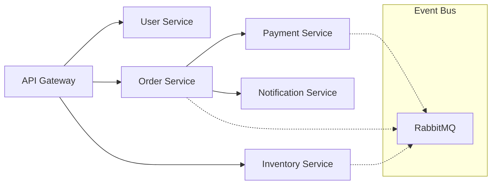
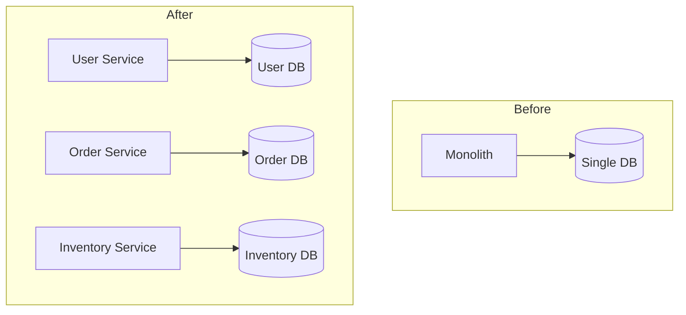
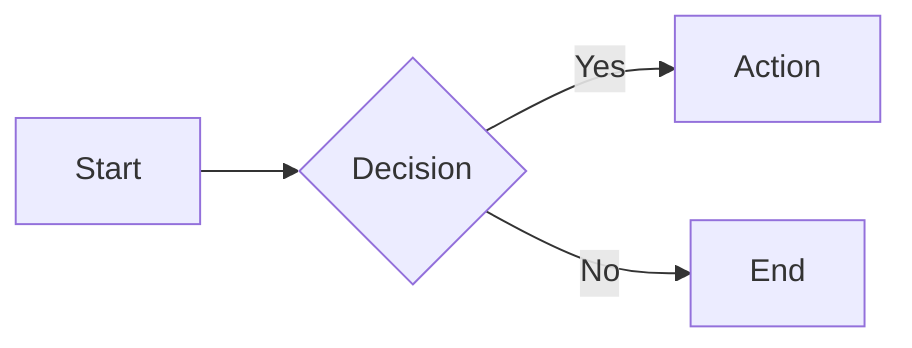

# Slide Builder

Create presentations with Slidev. Deploy to rebyte.pro.

## ⚠️ CRITICAL: Completion Requirements

**A slide presentation task is NOT complete until:**
1. ✅ Overflow check has passed (no content overflow issues)
2. ✅ Slides built with `pnpm build` (output in `dist/`)
3. ✅ **Invoke the `rebyte-app-builder` skill** to deploy the `dist/` folder
4. ✅ The live preview URL has been shared with the user
5. ✅ A slide index has been provided (see "After Deployment: Show Slide Index")

**NEVER deploy without checking for overflow first. NEVER tell the user the presentation is "done" without deploying.**

## Two-Phase Methodology

**Content first, polish later.**

### Phase 1: Drafting

Focus on narrative and structure:

- Write speaker notes as you go
- Use simple layouts
- **NO animations** - save for polishing
- Get content approved before styling

### Phase 2: Polishing (after content is complete)

Enhance selectively:

- Add click animations where they aid understanding
- Sync presenter notes with `[click]` markers
- Test each slide before moving to next
- Max 5-6 clicks per slide

**Key principle:** A presentation with good content and no animations beats one with flashy animations and poor content.

## Workflow

1. **Plan content** - Understand the presentation goal, audience, structure, **and tone**
2. **Initialize** - `bash scripts/init.sh <name> [theme]` (see Theme Selection below)
3. **Write slides (Drafting)** - Edit `/code/<name>/slides.md`, focus on content, NO animations
4. **Check overflow** - Run overflow checker before deploy (see Overflow Detection below)
5. **Fix overflow** - If issues found, fix them before proceeding
6. **Build** - `cd /code/<name> && pnpm build` → outputs to `dist/`
7. **Deploy** - **Invoke the `rebyte-app-builder` skill** to deploy the `dist/` folder → returns preview URL
8. **Review & Modify** - User reviews preview, requests changes by slide number
9. **Polish (optional)** - After content is approved, add animations selectively
10. **Export** (optional) - `bash scripts/export.sh pdf|pptx`

## Overflow Detection (CRITICAL)

**Before deploying, ALWAYS check for content overflow.** Slidev does not auto-fit content like PowerPoint - text/tables/code that exceed the slide boundary will be clipped.

### Install Checker (first time only)

```bash
npm install -g slidev-overflow-checker
npx playwright install
```

### Run Overflow Check

```bash
# Start dev server in background
pnpm run dev --port 3030 &

# Wait for server to start
sleep 10

# Run overflow checker
slidev-overflow-checker --url http://localhost:3030 --project ./
```

### Fix Overflow Issues

When overflow is detected, apply these fixes:

| Issue Type | Fix Strategy |
|------------|--------------|
| Too many bullet points (>5) | Split into multiple slides |
| Long table (>5 rows) | Wrap with `<Transform :scale="0.8">` |
| Long code block (>12 lines) | Split or wrap with `<Transform :scale="0.85">` |
| Wide table/content | Wrap with `<Transform :scale="0.75">` |
| Dense text | Reduce content or use smaller layout |

**Transform wrapper example:**
```markdown
<Transform :scale="0.8">

| Column 1 | Column 2 | Column 3 |
|----------|----------|----------|
| Row 1 | Data | Data |
| Row 2 | Data | Data |
| ... more rows ... |

</Transform>
```

### Re-check After Fixing

After fixing, re-run the checker to verify:
```bash
slidev-overflow-checker --url http://localhost:3030 --project ./
```

Only proceed to deploy when **no overflow issues** are reported.

## Theme Selection

### When to Choose Theme

Choose theme during **Step 2: Initialize**. Consider:
- Presentation topic and tone
- Target audience
- Formality level

### Available Themes

**Theme Package Naming Convention:**
- **Official themes**: `@slidev/theme-*` (e.g., `@slidev/theme-seriph`)
- **Community themes**: `slidev-theme-*` (e.g., `slidev-theme-dracula`)

The init script handles this automatically. When changing themes manually, use the correct package name format.

**Official Themes** (package: `@slidev/theme-<name>`):
| Theme | Style | Best For |
|-------|-------|----------|
| `seriph` | Elegant serif | Conference talks, keynotes |
| `default` | Clean minimal | Internal meetings, docs |
| `apple-basic` | Apple-inspired | Product demos, launches |
| `shibainu` | Warm friendly | Team updates, casual talks |
| `bricks` | Bold colorful | Creative pitches, workshops |

**Community Themes** (package: `slidev-theme-<name>`):
| Theme | Style | Best For |
|-------|-------|----------|
| `dracula` | Dark purple | Developer talks, tech deep-dives |
| `academic` | Paper-style | Thesis defense, research talks |
| `frankfurt` | Beamer-inspired | Academic conferences |
| `unicorn` | Rainbow/playful | Creative demos, fun topics |
| `penguin` | Personal brand | Personal presentations |
| `eloc` | Writing-focused | Documentation, tutorials |
| `excali-slide` | Excalidraw style | Whiteboard-style talks |
| `mint` | Fresh minimal | Clean presentations |
| `neversink` | Modern academic | Academic presentations |
| `the-unnamed` | VS Code theme | Developer audiences |
| `mokkapps` | Professional | Tech talks, conferences |
| `hep` | Scientific | Physics, science presentations |

### Auto-Selection Guide

Match topic to theme:

| Topic/Audience | Recommended Theme | Package Type |
|----------------|-------------------|--------------|
| Tech conference, keynote | `seriph` | Official |
| Developer/engineering | `dracula` or `the-unnamed` | Community |
| Startup pitch, investor | `seriph` or `mint` | Official/Community |
| Product launch, demo | `apple-basic` | Official |
| Internal team meeting | `default` | Official |
| Workshop, training | `shibainu` | Official |
| Creative/marketing | `bricks` or `unicorn` | Official/Community |
| Meetup, community talk | `penguin` or `mokkapps` | Community |
| Thesis defense, research | `academic` or `frankfurt` | Community |
| Scientific/physics | `hep` or `neversink` | Community |
| Whiteboard/sketch style | `excali-slide` | Community |

### Selection Flow

1. **User specifies theme** → Use that theme
2. **User doesn't specify** → Agent asks:
   > "What's the presentation context? I'll recommend a theme:
   > - Conference/keynote → `seriph`
   > - Developer audience → `dracula`
   > - Startup pitch → `seriph` or `mint`
   > - Or just use default `seriph`?"
3. **User says "auto" or "你选"** → Agent picks based on content topic

### Changing Theme Later

To change theme after init:
1. Edit `theme:` in slides.md frontmatter (e.g., `theme: dracula`)
2. Update package.json dependency with correct package name:
   - **Official themes**: `"@slidev/theme-<name>": "latest"` (default, seriph, apple-basic, shibainu, bricks)
   - **Community themes**: `"slidev-theme-<name>": "latest"` (all others)
3. Run `pnpm install` (or `npm install`)
4. Rebuild with `pnpm build` and redeploy using the `rebyte-app-builder` skill

Example for switching to `dracula` (community theme):
```json
"dependencies": {
  "@slidev/cli": "^51.0.0",
  "slidev-theme-dracula": "latest"
}
```

Example for switching to `bricks` (official theme):
```json
"dependencies": {
  "@slidev/cli": "^51.0.0",
  "@slidev/theme-bricks": "latest"
}
```

## Modification Workflow

### After Deployment: Show Slide Index

After deploying, ALWAYS show users a slide index so they can easily reference pages:

```
✅ Deployed: https://abc123.rebyte.pro

📑 Slide Index:
  1. Cover - "Customer Success Story"
  2. Agenda
  3. The Challenge
  4. Our Approach
  5. Implementation
  6. Key Results (metrics)
  7. Before vs After
  8. Testimonial
  9. Next Steps
  10. Thank You

💬 To request changes, quote the page number:
  "Page 3: change title to 'The Problem We Solved'"
  "Page 6: the metric should be 85%, not 75%"
  "Page 4-5: combine into one slide"
```

### Handling User Feedback

When user quotes a page with comments:

**User says:**
```
Page 3: The title should be more impactful, try "The $2M Problem"
Page 6: Add another metric about time savings
Page 8: Remove this slide, testimonial feels weak
```

**Response:**
1. Apply each change to the specified slide
2. Rebuild with `pnpm build` and redeploy using the `rebyte-app-builder` skill
3. Confirm changes with updated index:

```
✅ Updated 3 slides:
  - Page 3: Title changed to "The $2M Problem"
  - Page 6: Added time savings metric
  - Page 8: Removed (pages renumbered)

🔗 New preview: https://abc123.rebyte.pro

📑 Updated Slide Index:
  1. Cover - "Customer Success Story"
  2. Agenda
  3. The $2M Problem ← updated
  4. Our Approach
  5. Implementation
  6. Key Results ← updated
  7. Before vs After
  8. Next Steps ← was page 9
  9. Thank You ← was page 10

💬 More changes? Just quote the page number.
```

### Locating Slides in Code

Slides are separated by `---` in slides.md:
- Page 1 = content before first `---`
- Page 2 = content after first `---`
- Page N = content after (N-1)th `---`

When editing, count separators to find the right slide.

## Content Guidelines

### Structure

Every presentation needs:
- **Opening** (1-2 slides): Hook + agenda
- **Body** (80% of slides): Main content in logical sections
- **Closing** (1-2 slides): Summary + call-to-action

### Slide Count by Duration

| Duration | Slides | Pace |
|----------|--------|------|
| 5 min | 5-7 | ~1 min/slide |
| 15 min | 12-15 | ~1 min/slide |
| 30 min | 20-25 | ~1.5 min/slide |
| 45 min | 30-35 | ~1.5 min/slide |

### Content Rules

1. **One idea per slide** - If you need "and", split it
2. **6 words per bullet, 6 bullets max** - Slides support speech, not replace it
3. **No walls of text** - If reading takes >10 seconds, trim it
4. **Show, don't tell** - Prefer diagrams, code, images over prose
5. **Use animations sparingly** - Add during polishing phase only, max 5-6 clicks per slide

### Icons vs Emoji - When to Use What

This project includes `@iconify-json/mdi` (Material Design Icons) and `@iconify-json/logos` (brand logos).

**Use MDI icons `<mdi-* />` for:**
- Functional indicators: checkmarks, X marks, arrows, status icons
- UI elements: settings, search, menu, navigation
- List markers that indicate state (done/pending/error)
- Professional/technical presentations

**Use Logos icons `<logos-* />` for:**
- Technology brands: `<logos-vue />`, `<logos-react />`, `<logos-docker-icon />`
- Company logos in tech context

**Emoji is OK for:**
- Emotional/decorative use in casual presentations
- Section titles for visual interest (e.g., "🎉 Celebration")
- When the tone is informal/playful

**Example - Status List (use icons, not emoji):**
```markdown
<!-- ❌ Avoid for functional indicators -->
- ✅ Task completed
- ❌ Task failed
- ⏳ In progress

<!-- ✅ Preferred - cleaner, consistent rendering -->
- <mdi-check class="text-green-500" /> Task completed
- <mdi-close class="text-red-500" /> Task failed
- <mdi-clock class="text-yellow-500" /> In progress
```

**Example - Tech Stack (use logos, not emoji):**
```markdown
<!-- ❌ Avoid -->
🟢 Node.js | 🔵 TypeScript | 🐳 Docker

<!-- ✅ Preferred - actual brand logos -->
<logos-nodejs-icon /> Node.js | <logos-typescript-icon /> TypeScript | <logos-docker-icon /> Docker
```

| Need | ❌ Don't use | ✅ Use instead |
|------|-------------|----------------|
| Checkmark | ✓ ✔️ | `<mdi-check />` |
| Arrow | → ➡️ | `<mdi-arrow-right />` |
| Star | ⭐ ★ | `<mdi-star />` |
| Warning | ⚠️ | `<mdi-alert />` |
| Info | ℹ️ | `<mdi-information />` |
| GitHub | 🐙 | `<mdi-github />` |
| Email | 📧 ✉️ | `<mdi-email />` |
| Settings | ⚙️ | `<mdi-cog />` |
| Search | 🔍 | `<mdi-magnify />` |
| User | 👤 | `<mdi-account />` |

**Common MDI icons:**
```markdown
<mdi-check />           <!-- checkmark -->
<mdi-close />           <!-- X / close -->
<mdi-plus />            <!-- plus -->
<mdi-minus />           <!-- minus -->
<mdi-arrow-right />     <!-- arrow -->
<mdi-star />            <!-- star -->
<mdi-heart />           <!-- heart -->
<mdi-github />          <!-- GitHub -->
<mdi-rocket-launch />   <!-- rocket -->
<mdi-lightbulb />       <!-- idea -->
<mdi-chart-line />      <!-- chart -->
<mdi-clock />           <!-- time -->
<mdi-calendar />        <!-- date -->
<mdi-folder />          <!-- folder -->
<mdi-file-document />   <!-- document -->
```

**Brand logos** (use `logos-*` for tech brands):
```markdown
<logos-vue />
<logos-react />
<logos-typescript-icon />
<logos-nodejs-icon />
<logos-python />
<logos-docker-icon />
<logos-kubernetes />
<logos-aws />
<logos-google-cloud />
```

**Styling icons:**
```markdown
<mdi-check class="text-green-500" />
<mdi-star class="text-yellow-500 text-2xl" />
<mdi-github class="text-3xl" />
```

## Agent Rules

### Core Principles

1. **Ask only when blocked** - Don't over-clarify, assume and proceed
2. **One slide at a time** - Never batch edit multiple slides
3. **Get feedback** - Show progress before continuing
4. **No premature polish** - Complete content before any animations
5. **No invented frontmatter** - Only use options from `references/config.md`
6. **Prefer MDI icons over emoji** for functional indicators (✅→`<mdi-check />`, tech logos→`<logos-* />`)

### Frontmatter Rules (CRITICAL)

**Never invent or guess frontmatter options.** Invalid options cause rendering errors.

Before writing any frontmatter, consult `references/config.md` for valid options.

Common mistakes to avoid:
```yaml
# ❌ INVALID - these options do NOT exist:
animation: fade       # Use 'transition' instead
style: dark           # Use 'colorSchema' or 'class'
footer: "text"        # Not built-in
header: "text"        # Not built-in
showSlideNumber: true # Not a valid option

# ✅ VALID options:
transition: slide-left
colorSchema: dark
class: text-center
layout: two-cols
```

**Rule: If unsure about an option, check `references/config.md` or omit it.**

### Phase-Specific Rules

**During Drafting:**
- Focus on content and flow
- Skip all animations (v-click, v-clicks, v-mark)
- Use only basic layouts
- Write speaker notes for every slide

**During Polishing:**
- Work on one slide at a time
- Test each slide in browser before proceeding
- Validate click alignment with speaker notes
- See `references/animations.md` for Click Alignment system

### Layout Selection

| Content Type | Layout | When |
|--------------|--------|------|
| Title/section | `cover` | Opening, section breaks |
| Regular content | `default` | Most slides |
| Comparison | `two-cols` | A vs B, before/after |
| Feature + visual | `image-right` | Screenshots, diagrams |
| Key metric | `fact` | Statistics, numbers |
| Quote | `quote` | Citations, testimonials |
| Closing | `end` | Final slide |

## Best Practices: Building a Professional Presentation

### Recommended Setup

Always use this frontmatter for professional presentations:

```yaml
---
theme: seriph
title: Your Title
background: https://cover.sli.dev
class: text-center
highlighter: shiki
transition: slide-left
mdc: true
---
```

**Why `seriph` theme**: Elegant serif headings + clean sans-serif body. Professional for any audience.

### Feature Usage Guidelines

| Feature | When to Use | Frequency |
|---------|-------------|-----------|
| `v-clicks` | Bullet points, step-by-step reveals | 30-50% of slides |
| `v-mark` | Highlight key terms, metrics, conclusions | 3-5 per presentation |
| `two-cols` | Comparisons, before/after, pros/cons | 2-3 per presentation |
| `fact` layout | Key metrics, impressive numbers | 1-2 per presentation |
| Mermaid diagrams | Architecture, flows, processes | 1-3 per presentation |
| Code highlighting | Technical demos, code walkthroughs | As needed |
| `image-right` | Features with screenshots | 2-4 per presentation |
| Speaker notes | Every slide | 100% of slides |

### 15-Slide Professional Template

Use this structure for a typical 15-20 minute presentation:

```
Slide 1:  cover      - Title + subtitle + author
Slide 2:  default    - Agenda/outline (with v-clicks)
Slide 3:  center     - Problem statement or hook
Slide 4:  default    - Context/background (with v-clicks)
Slide 5:  image-right - Key concept with visual
Slide 6:  default    - Main point 1 (with v-clicks)
Slide 7:  two-cols   - Comparison or details
Slide 8:  default    - Main point 2 (with v-clicks)
Slide 9:  default    - Code example (with line highlighting)
Slide 10: default    - Main point 3 (with v-clicks)
Slide 11: default    - Mermaid diagram for architecture/flow
Slide 12: fact       - Key metric or result
Slide 13: two-cols   - Before vs After summary
Slide 14: quote      - Testimonial or key takeaway
Slide 15: end        - Thank you + contact/links
```

### Style Consistency Rules

1. **One transition type** - Use `slide-left` globally, don't mix
2. **Consistent v-clicks** - Either use for all bullet lists or none
3. **Same code style** - Pick one language highlighting, use throughout
4. **Color harmony** - Stick to theme colors, avoid custom colors
5. **Icons over emoji** - Always use `<mdi-*>` icons, never Unicode emoji (see Icons section above)

### Complete Professional Example (15 slides)

```markdown
---
theme: seriph
title: Microservices Migration
background: https://cover.sli.dev
class: text-center
highlighter: shiki
transition: slide-left
mdc: true
---

# Microservices Migration
## From Monolith to Scale

<div class="abs-br m-6 text-sm opacity-50">
  Jane Smith · Tech Lead · 2024
</div>

<!--
Welcome everyone. Today I'll share our journey migrating to microservices.
-->

---

# Agenda

<v-clicks>

- The problem with our monolith
- Migration strategy
- Technical implementation
- Results and lessons learned
- Q&A

</v-clicks>

<!--
We'll cover these 5 main topics in about 15 minutes.
-->

---
layout: center
class: text-center
---

# "Our deployments took 4 hours and failed 30% of the time"

<div class="text-sm opacity-50 mt-4">
  — Engineering Team, January 2023
</div>

<!--
This was the reality we faced. Let me explain how we got here.
-->

---

# The Monolith Problem

<v-clicks>

- **500K lines** of tightly coupled code
- **45-minute** build times
- **4-hour** deployment windows
- **30%** deployment failure rate
- **3 teams** blocked by each other

</v-clicks>

<!--
[click] Half a million lines in one repo
[click] Builds alone took 45 minutes
[click] We could only deploy on weekends
[click] Almost a third of deployments failed
[click] Teams couldn't work independently
-->

---
layout: image-right
image: https://images.unsplash.com/photo-1558494949-ef010cbdcc31?w=800
---

# Our Architecture (Before)

Single Node.js application:

- All features in one codebase
- Shared database
- No service boundaries
- Horizontal scaling only

<div class="text-sm opacity-50 mt-4">
  Everything deployed together, failed together
</div>

<!--
This is what we were dealing with. A classic monolith.
-->

---

# Migration Strategy

<v-clicks>

- **Strangler Fig Pattern** - Gradually replace, don't rewrite
- **Domain-Driven Design** - Identify bounded contexts
- **API Gateway** - Route traffic during transition
- **Event Sourcing** - Decouple with async messaging

</v-clicks>

<!--
We chose proven patterns rather than a big-bang rewrite.
-->

---
layout: two-cols
layoutClass: gap-8
---

# Bounded Contexts

We identified 6 domains:

<v-clicks>

- User Management
- Order Processing
- Inventory
- Payments
- Notifications
- Analytics

</v-clicks>

::right::

# Team Mapping

<v-clicks>

- Platform Team → User, Gateway
- Commerce Team → Order, Inventory
- Finance Team → Payments
- Growth Team → Notifications, Analytics

</v-clicks>

<!--
Each domain became a service, each team owned specific services.
-->

---

# Service Communication



<!--
Sync calls via REST, async events via RabbitMQ.
-->

---

# Implementation: API Gateway

```ts {1-3|5-9|11-15|all}
// Kong configuration
const gateway = new KongGateway({
  services: ['user', 'order', 'inventory', 'payment']
})

// Route configuration
gateway.route('/api/users/*', {
  service: 'user-service',
  stripPrefix: true
})

// Rate limiting per service
gateway.plugin('rate-limiting', {
  minute: 1000,
  policy: 'redis'
})
```

<!--
[click] Initialize gateway with our services
[click] Define routing rules
[click] Add rate limiting for protection
[click] Simple but powerful configuration
-->

---

# Database Migration

<v-clicks>

- Each service owns its data
- No shared databases
- Event-driven sync when needed
- Eventual consistency accepted

</v-clicks>



<!--
The hardest part was splitting the database. We went with database-per-service.
-->

---
layout: fact
---

# 15 minutes
Average deployment time (was 4 hours)

<!--
This is our biggest win. Let that sink in.
-->

---
layout: two-cols
---

# Before

- 4-hour deployments
- 30% failure rate
- 45-min builds
- Weekend-only releases
- Teams blocked

::right::

# After

- 15-min deployments
- 2% failure rate
- 5-min builds
- 20 deploys/day
- Independent teams

<!--
The transformation was dramatic across every metric.
-->

---

# Key Metrics

<div class="grid grid-cols-3 gap-8 mt-8">
  <div class="text-center">
    <div class="text-5xl font-bold text-blue-500">94%</div>
    <div class="text-sm opacity-75 mt-2">Faster Deployments</div>
  </div>
  <div class="text-center">
    <div class="text-5xl font-bold text-green-500">10x</div>
    <div class="text-sm opacity-75 mt-2">More Deploys/Day</div>
  </div>
  <div class="text-center">
    <div class="text-5xl font-bold text-purple-500">89%</div>
    <div class="text-sm opacity-75 mt-2">Build Time Reduction</div>
  </div>
</div>

<!--
These numbers speak for themselves.
-->

---
layout: quote
---

# "We ship features in days, not months. Teams move independently. It changed everything."

Engineering Director

<!--
This quote from our director summarizes the cultural shift.
-->

---
layout: end
---

# Thank You!

<div class="mt-8">

**Resources**
- Blog: engineering.example.com/microservices
- Code: github.com/example/migration-toolkit

**Contact**
- jane@example.com
- @janesmith

</div>

<!--
Thank you! Happy to take questions.
-->
```

## Slidev Syntax Quick Reference

### Slide Separator

```markdown
---

# Slide 1

Content

---

# Slide 2

More content
```

### Frontmatter (First Slide)

```yaml
---
theme: seriph
title: My Talk
background: https://cover.sli.dev
transition: slide-left
---
```

### Layouts

```markdown
---
layout: two-cols
---

# Left

Content

::right::

# Right

Content
```

### Code with Highlighting

```markdown
```ts {2-3|5}
const a = 1
const b = 2  // highlighted first
const c = 3  // highlighted first
const d = 4
const e = 5  // highlighted second
```
```

### Click Animations

```markdown
<v-clicks>

- Appears first
- Appears second
- Appears third

</v-clicks>
```

### Text Highlighting with v-mark

Use `v-mark` to draw attention to key terms with hand-drawn style markers:

```markdown
The <span v-mark.underline.red>most important</span> concept is this.

We achieved <span v-mark.circle.orange>95% accuracy</span> in testing.

<span v-mark.highlight.yellow>Remember this key point!</span>
```

**Available styles:** `underline` (default), `circle`, `highlight`, `box`, `strike-through`

**Colors:** `red`, `orange`, `yellow`, `green`, `blue`, or custom `v-mark="{ color: '#f59e0b' }"`

**When to use v-mark:**
- Highlighting key metrics or numbers
- Emphasizing important terms on first mention
- Drawing attention to conclusions or takeaways

### Mermaid Diagrams

```markdown

```

### Speaker Notes

```markdown
# Slide Title

Content

<!--
Speaker notes here (press P to view)
-->
```

## Available Themes

See [Theme Selection](#theme-selection) for the full list of 23 supported themes.

**Quick reference (most used):**
| Theme | Package | Style |
|-------|---------|-------|
| `seriph` | `@slidev/theme-seriph` | Elegant serif (default) |
| `default` | `@slidev/theme-default` | Clean minimal |
| `bricks` | `@slidev/theme-bricks` | Bold colorful |
| `dracula` | `slidev-theme-dracula` | Dark purple |
| `academic` | `slidev-theme-academic` | Paper-style |

**Package naming rule:**
- Official (5 themes): `@slidev/theme-<name>` — default, seriph, apple-basic, shibainu, bricks
- Community (all others): `slidev-theme-<name>`

To change theme: see [Changing Theme Later](#changing-theme-later).

## References

Load as needed based on presentation requirements:

| Topic | File | Contents |
|-------|------|----------|
| **Config** | `references/config.md` | **Frontmatter options (MUST READ before writing frontmatter)** |
| Layouts | `references/layouts.md` | All layout options, image layouts, iframe layouts |
| Animations | `references/animations.md` | v-clicks, transitions, Magic Move, motion |
| Components | `references/components.md` | Video, icons, Vue components, math |
| Diagrams | `references/diagrams.md` | Mermaid, PlantUML, all diagram types |
| Styling | `references/styling.md` | UnoCSS, themes, fonts, colors |
| Advanced | `references/advanced.md` | Presenter mode, export, recording, config |

