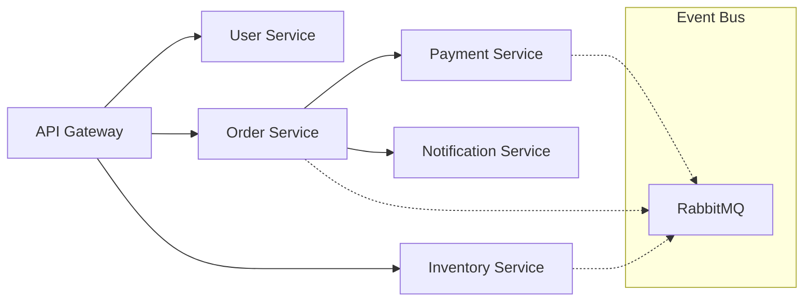
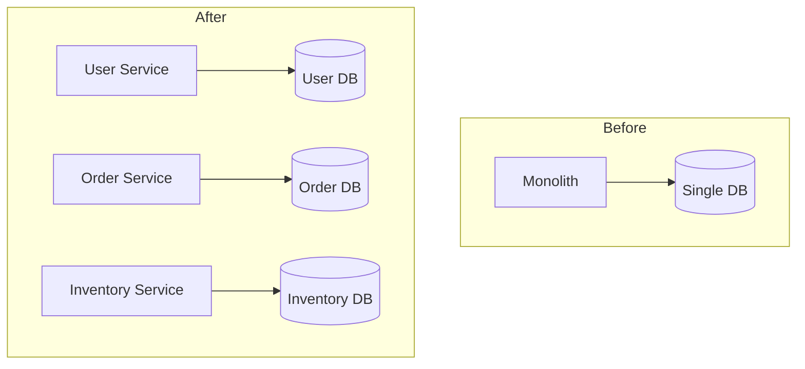
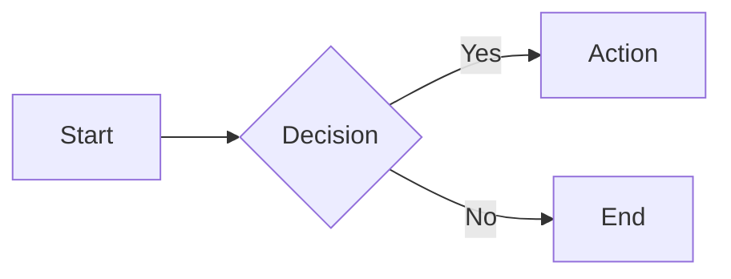

# Slide Builder

Create presentations with Slidev. Deploy to rebyte.pro.

## Workflow

1. **Plan content** - Understand the presentation goal, audience, and structure
2. **Initialize** - `bash scripts/init.sh <name> [theme]`
3. **Write slides** - Edit `/code/<name>/slides.md`
4. **Deploy** - `bash scripts/build-deploy.sh` → returns preview URL
5. **Export** (optional) - `bash scripts/export.sh pdf|pptx`

## Content Guidelines

### Structure

Every presentation needs:
- **Opening** (1-2 slides): Hook + agenda
- **Body** (80% of slides): Main content in logical sections
- **Closing** (1-2 slides): Summary + call-to-action

### Slide Count by Duration

| Duration | Slides | Pace |
|----------|--------|------|
| 5 min | 5-7 | ~1 min/slide |
| 15 min | 12-15 | ~1 min/slide |
| 30 min | 20-25 | ~1.5 min/slide |
| 45 min | 30-35 | ~1.5 min/slide |

### Content Rules

1. **One idea per slide** - If you need "and", split it
2. **6 words per bullet, 6 bullets max** - Slides support speech, not replace it
3. **No walls of text** - If reading takes >10 seconds, trim it
4. **Show, don't tell** - Prefer diagrams, code, images over prose
5. **Use animations sparingly** - Only for progressive reveals that aid understanding

### Layout Selection

| Content Type | Layout | When |
|--------------|--------|------|
| Title/section | `cover` | Opening, section breaks |
| Regular content | `default` | Most slides |
| Comparison | `two-cols` | A vs B, before/after |
| Feature + visual | `image-right` | Screenshots, diagrams |
| Key metric | `fact` | Statistics, numbers |
| Quote | `quote` | Citations, testimonials |
| Closing | `end` | Final slide |

## Best Practices: Building a Professional Presentation

### Recommended Setup

Always use this frontmatter for professional presentations:

```yaml
---
theme: seriph
title: Your Title
background: https://cover.sli.dev
class: text-center
highlighter: shiki
transition: slide-left
mdc: true
---
```

**Why `seriph` theme**: Elegant serif headings + clean sans-serif body. Professional for any audience.

### Feature Usage Guidelines

| Feature | When to Use | Frequency |
|---------|-------------|-----------|
| `v-clicks` | Bullet points, step-by-step reveals | 30-50% of slides |
| `two-cols` | Comparisons, before/after, pros/cons | 2-3 per presentation |
| `fact` layout | Key metrics, impressive numbers | 1-2 per presentation |
| Mermaid diagrams | Architecture, flows, processes | 1-3 per presentation |
| Code highlighting | Technical demos, code walkthroughs | As needed |
| `image-right` | Features with screenshots | 2-4 per presentation |
| Speaker notes | Every slide | 100% of slides |

### 15-Slide Professional Template

Use this structure for a typical 15-20 minute presentation:

```
Slide 1:  cover      - Title + subtitle + author
Slide 2:  default    - Agenda/outline (with v-clicks)
Slide 3:  center     - Problem statement or hook
Slide 4:  default    - Context/background (with v-clicks)
Slide 5:  image-right - Key concept with visual
Slide 6:  default    - Main point 1 (with v-clicks)
Slide 7:  two-cols   - Comparison or details
Slide 8:  default    - Main point 2 (with v-clicks)
Slide 9:  default    - Code example (with line highlighting)
Slide 10: default    - Main point 3 (with v-clicks)
Slide 11: default    - Mermaid diagram for architecture/flow
Slide 12: fact       - Key metric or result
Slide 13: two-cols   - Before vs After summary
Slide 14: quote      - Testimonial or key takeaway
Slide 15: end        - Thank you + contact/links
```

### Style Consistency Rules

1. **One transition type** - Use `slide-left` globally, don't mix
2. **Consistent v-clicks** - Either use for all bullet lists or none
3. **Same code style** - Pick one language highlighting, use throughout
4. **Color harmony** - Stick to theme colors, avoid custom colors
5. **Icon consistency** - Use one icon set (e.g., `mdi-*` or `carbon-*`)

### Complete Professional Example (15 slides)

```markdown
---
theme: seriph
title: Microservices Migration
background: https://cover.sli.dev
class: text-center
highlighter: shiki
transition: slide-left
mdc: true
---

# Microservices Migration
## From Monolith to Scale

<div class="abs-br m-6 text-sm opacity-50">
  Jane Smith · Tech Lead · 2024
</div>

<!--
Welcome everyone. Today I'll share our journey migrating to microservices.
-->

---

# Agenda

<v-clicks>

- The problem with our monolith
- Migration strategy
- Technical implementation
- Results and lessons learned
- Q&A

</v-clicks>

<!--
We'll cover these 5 main topics in about 15 minutes.
-->

---
layout: center
class: text-center
---

# "Our deployments took 4 hours and failed 30% of the time"

<div class="text-sm opacity-50 mt-4">
  — Engineering Team, January 2023
</div>

<!--
This was the reality we faced. Let me explain how we got here.
-->

---

# The Monolith Problem

<v-clicks>

- **500K lines** of tightly coupled code
- **45-minute** build times
- **4-hour** deployment windows
- **30%** deployment failure rate
- **3 teams** blocked by each other

</v-clicks>

<!--
[click] Half a million lines in one repo
[click] Builds alone took 45 minutes
[click] We could only deploy on weekends
[click] Almost a third of deployments failed
[click] Teams couldn't work independently
-->

---
layout: image-right
image: https://images.unsplash.com/photo-1558494949-ef010cbdcc31?w=800
---

# Our Architecture (Before)

Single Node.js application:

- All features in one codebase
- Shared database
- No service boundaries
- Horizontal scaling only

<div class="text-sm opacity-50 mt-4">
  Everything deployed together, failed together
</div>

<!--
This is what we were dealing with. A classic monolith.
-->

---

# Migration Strategy

<v-clicks>

- **Strangler Fig Pattern** - Gradually replace, don't rewrite
- **Domain-Driven Design** - Identify bounded contexts
- **API Gateway** - Route traffic during transition
- **Event Sourcing** - Decouple with async messaging

</v-clicks>

<!--
We chose proven patterns rather than a big-bang rewrite.
-->

---
layout: two-cols
layoutClass: gap-8
---

# Bounded Contexts

We identified 6 domains:

<v-clicks>

- User Management
- Order Processing
- Inventory
- Payments
- Notifications
- Analytics

</v-clicks>

::right::

# Team Mapping

<v-clicks>

- Platform Team → User, Gateway
- Commerce Team → Order, Inventory
- Finance Team → Payments
- Growth Team → Notifications, Analytics

</v-clicks>

<!--
Each domain became a service, each team owned specific services.
-->

---

# Service Communication



<!--
Sync calls via REST, async events via RabbitMQ.
-->

---

# Implementation: API Gateway

```ts {1-3|5-9|11-15|all}
// Kong configuration
const gateway = new KongGateway({
  services: ['user', 'order', 'inventory', 'payment']
})

// Route configuration
gateway.route('/api/users/*', {
  service: 'user-service',
  stripPrefix: true
})

// Rate limiting per service
gateway.plugin('rate-limiting', {
  minute: 1000,
  policy: 'redis'
})
```

<!--
[click] Initialize gateway with our services
[click] Define routing rules
[click] Add rate limiting for protection
[click] Simple but powerful configuration
-->

---

# Database Migration

<v-clicks>

- Each service owns its data
- No shared databases
- Event-driven sync when needed
- Eventual consistency accepted

</v-clicks>



<!--
The hardest part was splitting the database. We went with database-per-service.
-->

---
layout: fact
---

# 15 minutes
Average deployment time (was 4 hours)

<!--
This is our biggest win. Let that sink in.
-->

---
layout: two-cols
---

# Before

- 4-hour deployments
- 30% failure rate
- 45-min builds
- Weekend-only releases
- Teams blocked

::right::

# After

- 15-min deployments
- 2% failure rate
- 5-min builds
- 20 deploys/day
- Independent teams

<!--
The transformation was dramatic across every metric.
-->

---

# Key Metrics

<div class="grid grid-cols-3 gap-8 mt-8">
  <div class="text-center">
    <div class="text-5xl font-bold text-blue-500">94%</div>
    <div class="text-sm opacity-75 mt-2">Faster Deployments</div>
  </div>
  <div class="text-center">
    <div class="text-5xl font-bold text-green-500">10x</div>
    <div class="text-sm opacity-75 mt-2">More Deploys/Day</div>
  </div>
  <div class="text-center">
    <div class="text-5xl font-bold text-purple-500">89%</div>
    <div class="text-sm opacity-75 mt-2">Build Time Reduction</div>
  </div>
</div>

<!--
These numbers speak for themselves.
-->

---
layout: quote
---

# "We ship features in days, not months. Teams move independently. It changed everything."

Engineering Director

<!--
This quote from our director summarizes the cultural shift.
-->

---
layout: end
---

# Thank You!

<div class="mt-8">

**Resources**
- Blog: engineering.example.com/microservices
- Code: github.com/example/migration-toolkit

**Contact**
- jane@example.com
- @janesmith

</div>

<!--
Thank you! Happy to take questions.
-->
```

## Slidev Syntax Quick Reference

### Slide Separator

```markdown
---

# Slide 1

Content

---

# Slide 2

More content
```

### Frontmatter (First Slide)

```yaml
---
theme: seriph
title: My Talk
background: https://cover.sli.dev
transition: slide-left
---
```

### Layouts

```markdown
---
layout: two-cols
---

# Left

Content

::right::

# Right

Content
```

### Code with Highlighting

```markdown
```ts {2-3|5}
const a = 1
const b = 2  // highlighted first
const c = 3  // highlighted first
const d = 4
const e = 5  // highlighted second
```
```

### Click Animations

```markdown
<v-clicks>

- Appears first
- Appears second
- Appears third

</v-clicks>
```

### Mermaid Diagrams

```markdown

```

### Speaker Notes

```markdown
# Slide Title

Content

<!--
Speaker notes here (press P to view)
-->
```

## Available Themes

| Theme | Style | Best For |
|-------|-------|----------|
| `seriph` | Elegant serif | Conference talks (default) |
| `default` | Clean minimal | Internal meetings |
| `dracula` | Dark purple | Developer audiences |
| `geist` | Modern tech | Startup pitches |

To change: edit `theme:` in frontmatter and add package to package.json.

## References

Load as needed based on presentation requirements:

| Topic | File | Contents |
|-------|------|----------|
| Layouts | `references/layouts.md` | All layout options, image layouts, iframe layouts |
| Animations | `references/animations.md` | v-clicks, transitions, Magic Move, motion |
| Components | `references/components.md` | Video, icons, Vue components, math |
| Diagrams | `references/diagrams.md` | Mermaid, PlantUML, all diagram types |
| Styling | `references/styling.md` | UnoCSS, themes, fonts, colors |
| Advanced | `references/advanced.md` | Presenter mode, export, recording, config |

