# Slidev Diagrams Reference

## Mermaid Diagrams

Slidev has built-in Mermaid support.

### Flowchart

```markdown
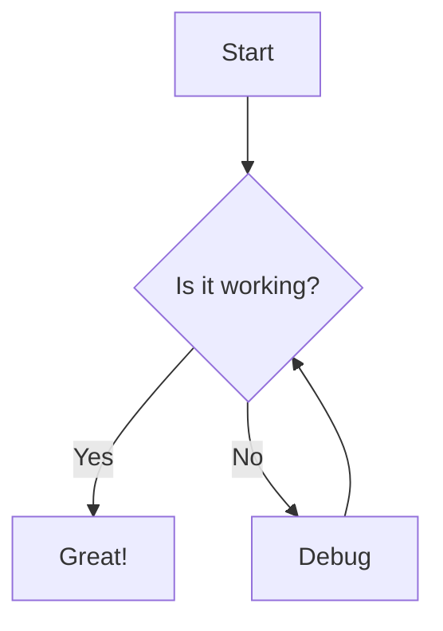
```

Direction options: `TD` (top-down), `TB`, `BT`, `LR` (left-right), `RL`

### Flowchart with Styling

```markdown
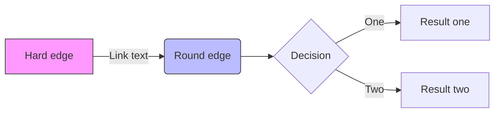
```

### Sequence Diagram

```markdown
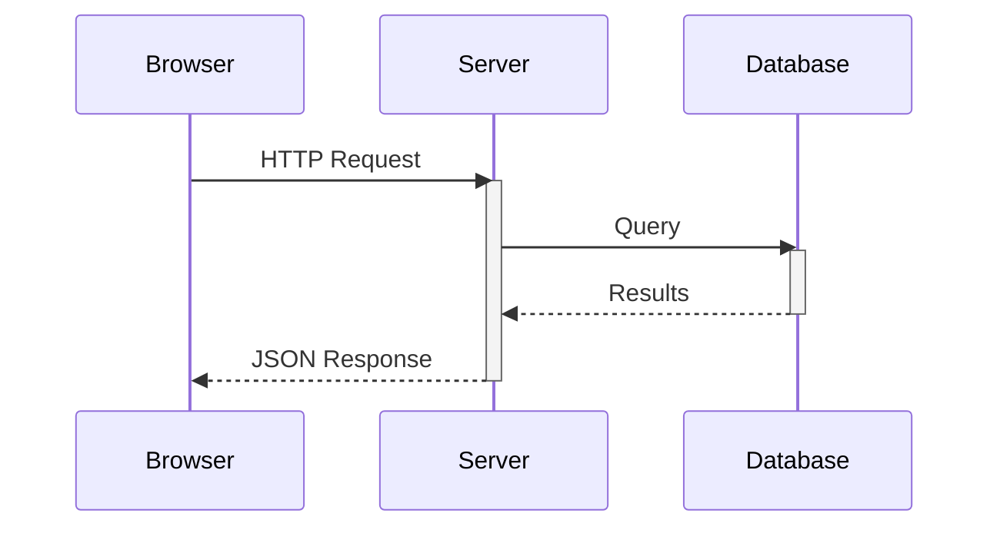
```

### Sequence with Notes

```markdown
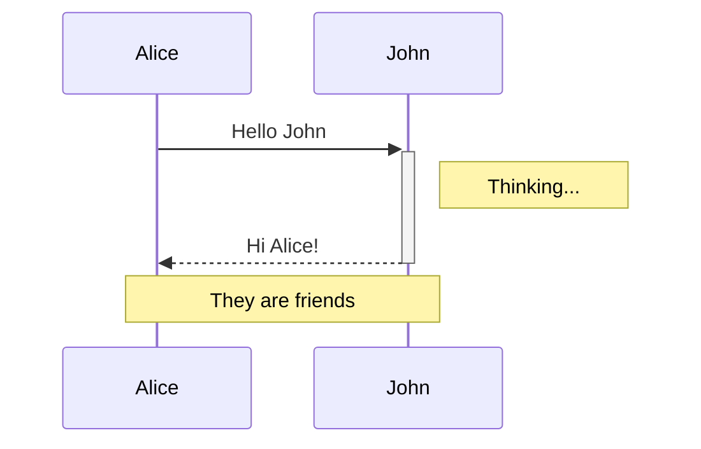
```

### Class Diagram

```markdown
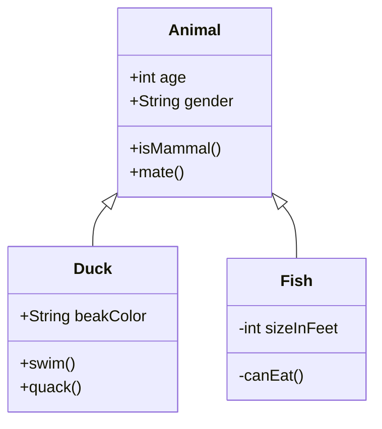
```

### State Diagram

```markdown
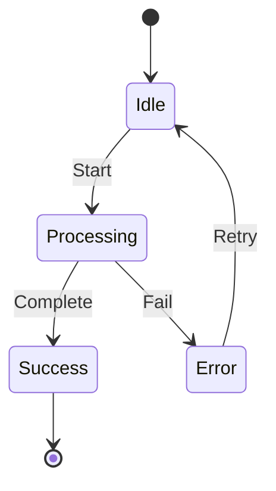
```

### Entity Relationship Diagram

```markdown
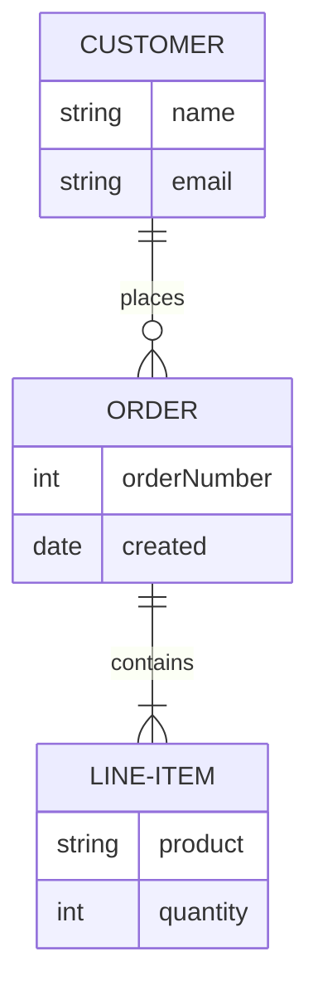
```

### Gantt Chart

```markdown
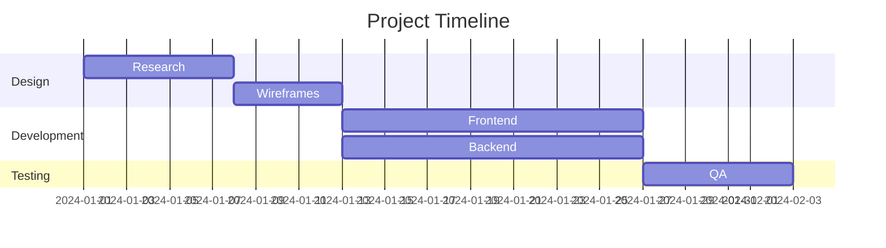
```

### Pie Chart

```markdown
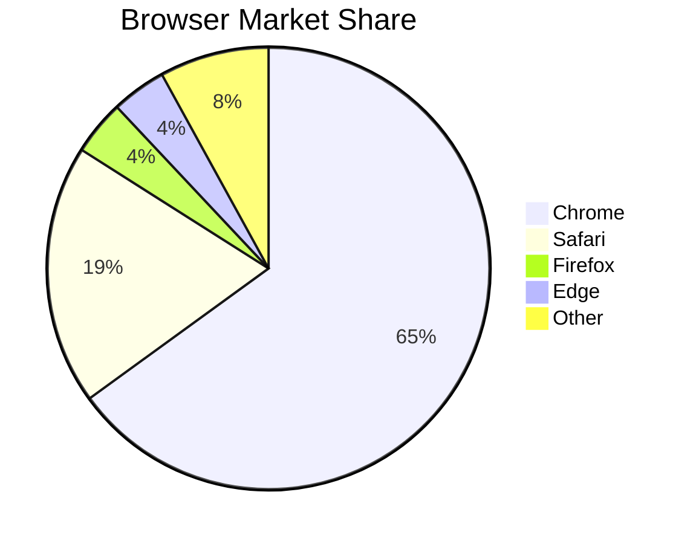
```

### Git Graph

```markdown
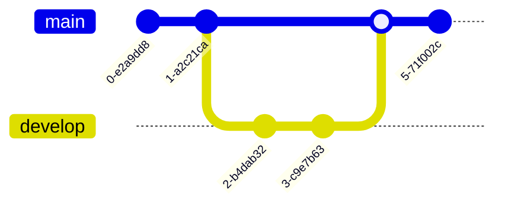
```

### Journey Map

```markdown
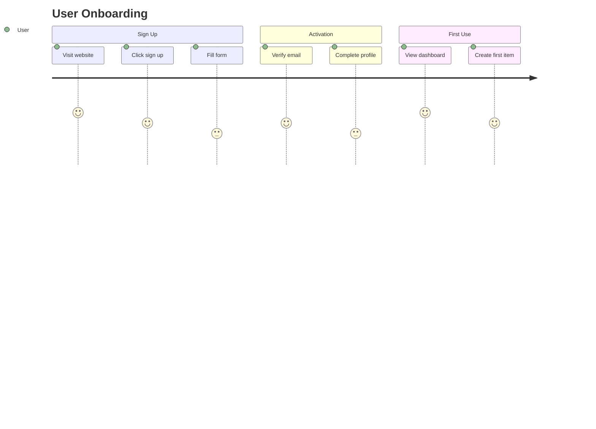
```

### Mindmap

```markdown
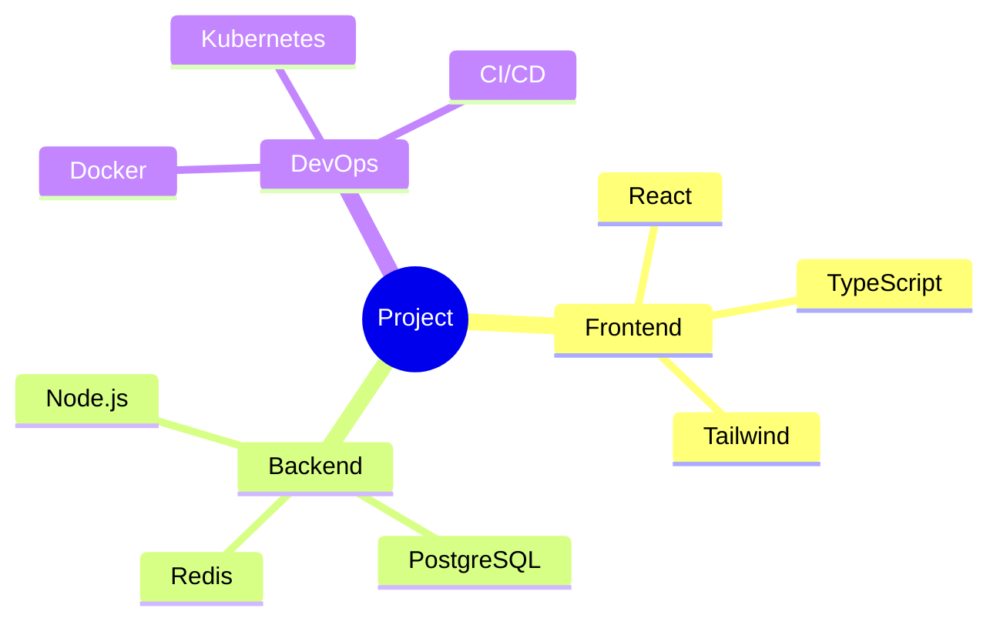
```

### Timeline

```markdown
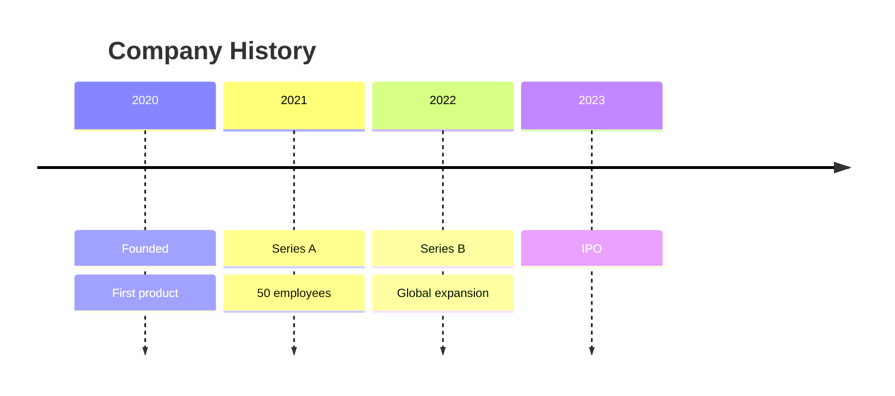
```

### Quadrant Chart

```markdown
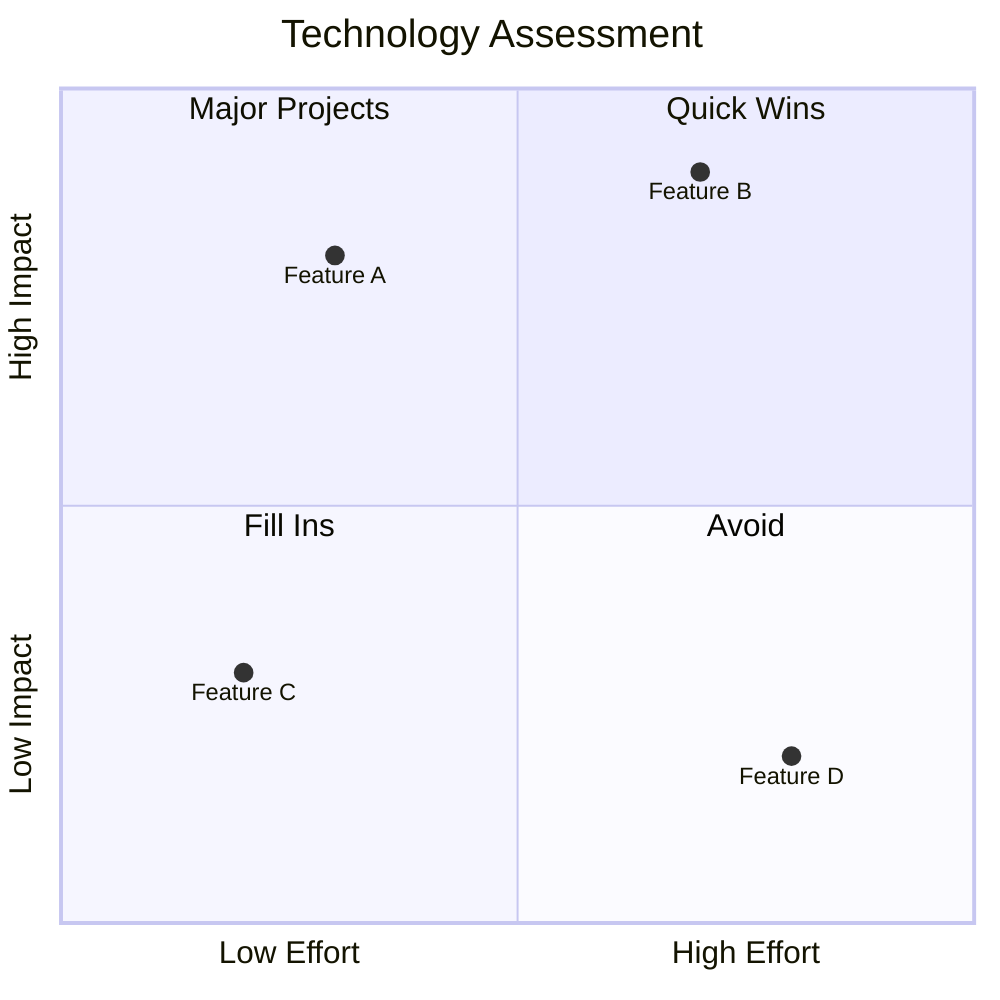
```

### Mermaid Theming

```markdown
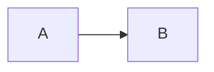
```

Available themes: `default`, `dark`, `forest`, `neutral`

---

## PlantUML

Enable PlantUML (requires server or local installation):

```yaml
# In frontmatter or vite.config.ts
plantuml:
  server: 'https://www.plantuml.com/plantuml'
```

### PlantUML Sequence

```markdown
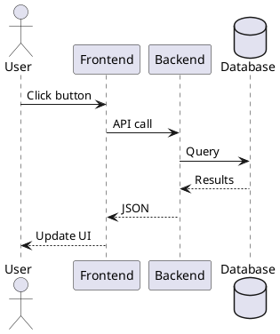
```

### PlantUML Class

```markdown
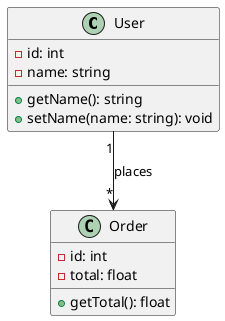
```

### PlantUML Component

```markdown
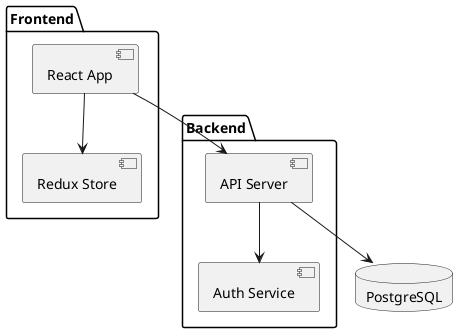
```

---

## ASCII Diagrams

For simple diagrams, ASCII art works well in code blocks:

```markdown
```
┌─────────────┐     ┌─────────────┐
│   Client    │────>│   Server    │
└─────────────┘     └─────────────┘
                          │
                          v
                    ┌─────────────┐
                    │  Database   │
                    └─────────────┘
```
```

---

## Diagram Best Practices

### Size Control

```markdown
<div class="w-3/4 mx-auto">

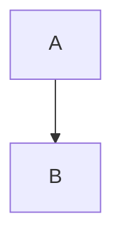

</div>
```

### With Click Animation

```markdown
<div v-click>


</div>
```

### Multiple Diagrams

Use two-cols layout:

```markdown
---
layout: two-cols
---

```mermaid
graph TD
    A --> B
```

::right::

```mermaid
graph TD
    C --> D
```
```

### When to Use Each

| Diagram Type | Use For |
|--------------|---------|
| Flowchart | Processes, algorithms, decisions |
| Sequence | API calls, interactions, protocols |
| Class | OOP design, data models |
| ER | Database schemas |
| State | State machines, lifecycles |
| Gantt | Project timelines |
| Pie | Proportions, distributions |
| Git Graph | Branching strategies |
| Mindmap | Brainstorming, hierarchies |
| Journey | User flows, experiences |
