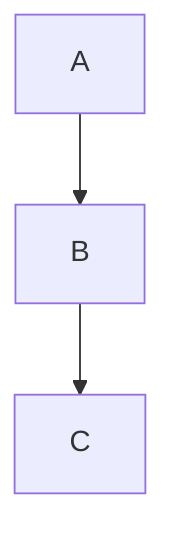
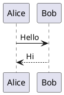

# Slidev Markdown Syntax Reference

## Slide Separators

Use three dashes `---` to separate slides:

```markdown
# Slide 1

Content

---

# Slide 2

More content
```

## Frontmatter

Each slide can have YAML frontmatter:

```markdown
---
layout: center
class: text-center
transition: slide-up
---

# Centered Slide
```

### Global Frontmatter (First Slide)

```yaml
---
theme: seriph                    # Theme name
title: Presentation Title        # Browser tab title
info: |                          # Presentation metadata
  ## Description
  Author: Your Name
background: https://url.jpg      # Background image
class: text-center               # CSS classes
highlighter: shiki               # Code highlighter (shiki/prism)
lineNumbers: true                # Show line numbers in code
drawings:
  persist: false                 # Persist drawings
transition: slide-left           # Default transition
mdc: true                        # Enable MDC syntax
---
```

## Text Formatting

```markdown
**bold**
*italic*
~~strikethrough~~
`inline code`
[link](https://url.com)
```

## Lists

```markdown
- Unordered item
- Another item
  - Nested item

1. Ordered item
2. Another item
```

## Code Blocks

### Basic

```markdown
```javascript
const hello = "world"
```
```

### Line Highlighting

```markdown
```ts {2,3}
const a = 1
const b = 2  // highlighted
const c = 3  // highlighted
```
```

### Step-by-step Highlighting

```markdown
```ts {1|2-3|all}
const a = 1      // Step 1
const b = 2      // Step 2
const c = a + b  // Step 2
// Step 3: all lines
```
```

### Line Numbers

```markdown
```ts {1,3} {lines:true}
const a = 1
const b = 2
const c = 3
```
```

### Max Height

```markdown
```ts {maxHeight:'200px'}
// Long code block
// Will be scrollable
```
```

### Monaco Editor (Editable)

```markdown
```ts {monaco}
// This code is editable in the browser
const x = 1
```
```

## Images

```markdown


<!-- With styling -->
{width=300px}

<!-- Remote images are cached automatically -->

```

## Two-Column Layout

```markdown
---
layout: two-cols
---

# Left

Content on left

::right::

# Right

Content on right
```

## Named Slots

```markdown
---
layout: two-cols-header
---

# Header

::left::

Left content

::right::

Right content
```

## Click Animations

### v-clicks Container

```markdown
<v-clicks>

- Item 1 (appears on click)
- Item 2 (appears on next click)
- Item 3 (appears on next click)

</v-clicks>
```

### Individual v-click

```markdown
<div v-click>Appears on click</div>
<div v-click>Appears on next click</div>
```

### Custom Order

```markdown
<div v-click="2">Second</div>
<div v-click="1">First</div>
<div v-click="3">Third</div>
```

### Hide After

```markdown
<div v-click="[1, 3]">
  Visible from click 1 to click 3
</div>
```

### Click to Hide

```markdown
<div v-click.hide>
  Visible initially, hides on click
</div>
```

## Arrows and Annotations

```markdown
<arrow x1="100" y1="100" x2="200" y2="200" color="red" width="2" />
```

## Presenter Notes

```markdown
---

# Slide

Content here

<!--
Speaker notes go here.
Only visible in presenter mode.
Press P to toggle presenter mode.
-->
```

## Math (LaTeX)

### Inline Math

```markdown
The formula $E = mc^2$ is famous.
```

### Block Math

```markdown
$$
\int_0^\infty e^{-x^2} dx = \frac{\sqrt{\pi}}{2}
$$
```

## Diagrams

### Mermaid

```markdown

```

### PlantUML

```markdown

```

## HTML in Markdown

```markdown
<div class="flex gap-4">
  <div>Column 1</div>
  <div>Column 2</div>
</div>
```

## Vue Components

```markdown
<Counter :count="10" />

<Tweet id="1234567890" />
```

## Icons

Using Iconify:

```markdown
<mdi-account /> User
<logos-vue /> Vue.js
<carbon-api /> API
<ph-globe /> Website
```

## Transitions

### Per-Slide

```markdown
---
transition: slide-up
---
```

### Available Transitions

- `fade` - Crossfade
- `fade-out` - Fade out then in
- `slide-left` - Slide from right
- `slide-right` - Slide from left
- `slide-up` - Slide from bottom
- `slide-down` - Slide from top
- `view-transition` - Native view transitions

## Keyboard Shortcuts (In Presentation)

| Key | Action |
|-----|--------|
| `Space` / `Right` | Next animation/slide |
| `Left` | Previous animation/slide |
| `Up` | Previous slide |
| `Down` | Next slide |
| `P` | Presenter mode |
| `O` | Slides overview |
| `D` | Dark mode toggle |
| `F` | Fullscreen |
| `G` | Go to slide (enter number) |
| `Esc` | Exit focus mode |
